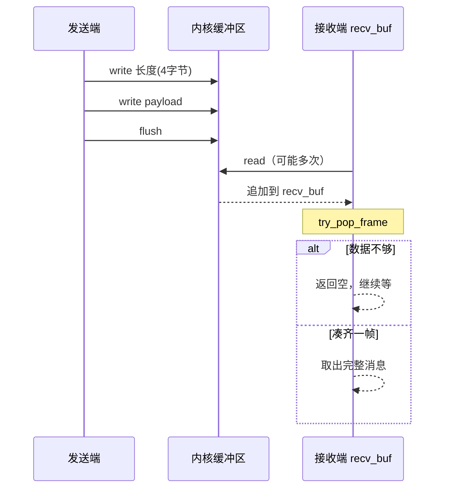
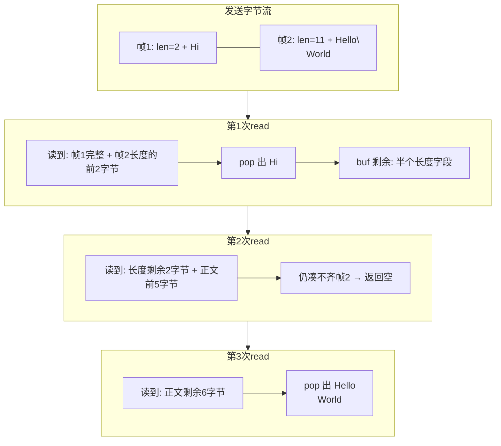
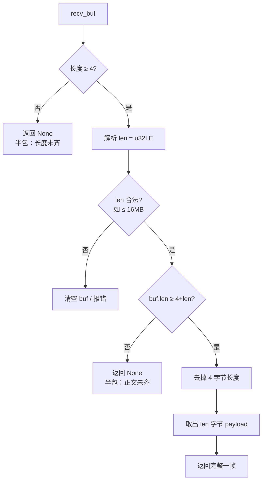

# Rust 封装IPC方便其他语言复用

## 单测

1. 编译生成动态链接库`cargo build --release`

2. 测试脚本里使用的是相对路径，要`cd`到`python`文件夹执行测试脚本

## 长度前缀协议示意

1. 单帧结构

| 偏移 | 0..3          | 4 .. 4+len-1   |
| ---- | ------------- | -------------- |
| 含义 | 长度 (u32LE)  | payload 正文   |
| 示例 | `0B 00 00 00` | `Hello\nWorld` |

2. 发送 / 接收流程

3. 两帧、分三次读完（半包 + 粘包）

4. try_pop_frame 判断逻辑

